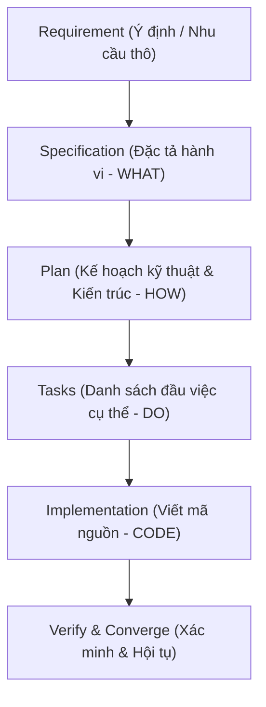
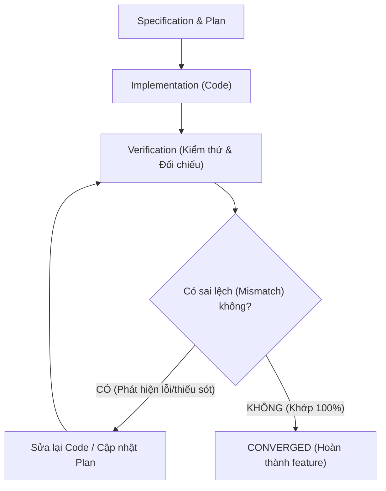

# Spec-Driven Development (SDD) & GitHub Spec Kit: Sổ Tay Học Tập Toàn Diện

> **Textbook cá nhân** — Hệ thống hóa toàn bộ tư duy nền tảng, mental model, quy trình chuyển đổi artifacts và phương pháp thực hành Spec-Driven Development (SDD) trong kỷ nguyên phát triển phần mềm có sự trợ giúp của AI (AI-Assisted Engineering).

---

## Mục Lục

- [Phần I — Tổng Quan Về Spec-Driven Development (SDD)](#phần-i--tổng-quan-về-spec-driven-development-sdd)
  - [1.1. SDD là gì?](#11-sdd-là-gì)
  - [1.2. Tại sao SDD xuất hiện?](#12-tại-sao-sdd-xuất-hiện)
  - [1.3. Cạm bẫy của quy trình "Requirement → AI → Code"](#13-cạm-bẫy-của-quy-trình-requirement--ai--code)
  - [1.4. AI Coding Agent gặp khó khăn gì khi Requirement mơ hồ?](#14-ai-coding-agent-gặp-khó-khăn-gì-khi-requirement-mơ-hồ)
  - [1.5. SDD giải quyết bài toán đó như thế nào?](#15-sdd-giải-quyết-bài-toán-đó-như-thế-nào)
  - [1.6. Vai trò của Specification trong AI-Assisted Development](#16-vai-trò-của-specification-trong-ai-assisted-development)
  - [1.7. Specification như một Living Artifact](#17-specification-như-một-living-artifact)
  - [1.8. Mental Model cốt lõi của quy trình SDD](#18-mental-model-cốt-lõi-của-quy-trình-sdd)
- [Phần II — Khám Phá: Requirement (Yêu Cầu)](#phần-ii--khám-phá-requirement-yêu-cầu)
  - [2.1. Requirement là gì và trả lời câu hỏi nào?](#21-requirement-là-gì-và-trả-lời-câu-hỏi-nào)
  - [2.2. Phân tích tính mơ hồ (Ambiguity) của Requirement thô](#22-phân-tích-tính-mơ-hồ-ambiguity-của-requirement-thô)
  - [2.3. Requirement không phải Implementation Contract](#23-requirement-không-phải-implementation-contract)
- [Phần III — Nền Tảng: Specification (Đặc Tả)](#phần-iii--nền-tảng-specification-đặc-tả)
  - [3.1. Mental Model: "Hệ thống phải hoạt động như thế nào?"](#31-mental-model-hệ-thống-phải-hoạt-động-như-thế-nào)
  - [3.2. Cấu trúc chuẩn mực của một Specification](#32-cấu-trúc-chuẩn-mực-của-một-specification)
  - [3.3. User Stories](#33-user-stories)
  - [3.4. Acceptance Scenarios (Given / When / Then)](#34-acceptance-scenarios-given--when--then)
  - [3.5. Functional Requirements (Yêu cầu chức năng)](#35-functional-requirements-yêu-cầu-chức-năng)
  - [3.6. Non-functional Requirements (Yêu cầu phi chức năng)](#36-non-functional-requirements-yêu-cầu-phi-chức-năng)
  - [3.7. Edge Cases (Trường hợp biên / Ngoại lệ)](#37-edge-cases-trường-hợp-biên--ngoại-lệ)
  - [3.8. Out of Scope (Phạm vi loại trừ) — "Vũ khí" chặn Scope Creep](#38-out-of-scope-phạm-vi-loại-trừ--vũ-khí-chặn-scope-creep)
- [Phần IV — Cầu Nối: Plan (Kế Hoạch Kiến Trúc & Thiết Kế Kỹ Thuật)](#phần-iv--cầu-nối-plan-kế-hoạch-kiến-trúc--thiết-kế-kỹ-thuật)
  - [4.1. Sự khác biệt cốt tử: WHAT vs HOW](#41-sự-khác-biệt-cốt-tử-what-vs-how)
  - [4.2. Mental Model: Công thức tạo nên một Plan vững chắc](#42-mental-model-công-thức-tạo-nên-một-plan-vững-chắc)
  - [4.3. Các yếu tố bắt buộc của một Technical Plan](#43-các-yếu-tố-bắt-buộc-của-một-technical-plan)
  - [4.4. Ví dụ phân định Specification vs Plan](#44-ví-dụ-phân-định-specification-vs-plan)
- [Phần V — Hành Động: Tasks (Nhiệm Vụ Thực Thi Chi Tiết)](#phần-v--hành-động-tasks-nhiệm-vụ-thực-thi-chi-tiết)
  - [5.1. Mental Model: "Thiết kế thế nào?" vs "Cụ thể phải làm việc gì?"](#51-mental-model-thiết-kế-thế-nào-vs-cụ-thể-phải-làm-việc-gì)
  - [5.2. Chuyển hóa Plan thành danh sách Tasks khả thi](#52-chuyển-hóa-plan-thành-danh-sách-tasks-khả-thi)
  - [5.3. Tiêu chí phân biệt Task tốt và Task kém](#53-tiêu-chí-phân-biệt-task-tốt-và-task-kém)
- [Phần VI — Thi Công: Implementation (Viết Mã Nguồn)](#phần-vi--thi-công-implementation-viết-mã-nguồn)
  - [6.1. Vị trí của Implementation trong chuỗi giá trị SDD](#61-vị-trí-của-implementation-trong-chuỗi-giá-trị-sdd)
  - [6.2. Kiểm soát AI Coding Agent trong quá trình Implementation](#62-kiểm-soát-ai-coding-agent-trong-quá-trình-implementation)
- [Phần VII — Hoàn Thiện: Verification & Convergence (Xác Minh & Hội Tụ)](#phần-vii--hoàn-thiện-verification--convergence-xác-minh--hội-tụ)
  - [7.1. Cạm bẫy: "Code chạy được" ≠ "Feature đúng Specification"](#71-cạm-bẫy-code-chạy-được--feature-đúng-specification)
  - [7.2. Các khía cạnh cần kiểm tra trong Verification](#72-các-khía-cạnh-cần-kiểm-tra-trong-verification)
  - [7.3. Vòng lặp hội tụ (Convergence Loop)](#73-vòng-lặp-hội-tụ-convergence-loop)
- [Phần VIII — Giới Thiệu Sơ Lược: Constitution (Hiến Pháp Dự Án)](#phần-viii--giới-thiệu-sơ-lược-constitution-hiến-pháp-dự-án)
  - [8.1. Constitution là gì và tại sao dự án cần Constitution?](#81-constitution-là-gì-và-tại-sao-dự-án-cần-constitution)
  - [8.2. Tính chất xuyên suốt (Cross-cutting Nature) của Constitution](#82-tính-chất-xuyên-suốt-cross-cutting-nature-của-constitution)
- [Phần IX — Khả Năng Truy Vết: Traceability](#phần-ix--khả-năng-truy-vết-traceability)
  - [9.1. Chuỗi truy vết xuôi và ngược](#91-chuỗi-truy-vết-xuôi-và-ngược)
  - [9.2. Giá trị thực tiễn của Traceability](#92-giá-trị-thực-tiễn-của-traceability)
- [Phần X — So Sánh & Phân Biệt Các Cặp Khái Niệm Dễ Nhầm Lẫn](#phần-x--so-sánh--phân-biệt-các-cặp-khái-niệm-dễ-nhầm-lẫn)
  - [10.1. Bảng ma trận so sánh tổng quan](#101-bảng-ma-trận-so-sánh-tổng-quan)
  - [10.2. Phân tích chi tiết từng cặp khái niệm](#102-phân-tích-chi-tiết-từng-cặp-khái-niệm)
- [Phần XI — Thực Hành Xuyên Suốt: Ví Dụ Tính Năng User Registration](#phần-xi--thực-hành-xuyên-suốt-ví-dụ-tính-năng-user-registration)
  - [Bước 1: Requirement thô](#bước-1-requirement-thô)
  - [Bước 2: Chuẩn hóa thành Specification](#bước-2-chuẩn-hóa-thành-specification)
  - [Bước 3: Lập Technical Plan](#bước-3-lập-technical-plan)
  - [Bước 4: Chia nhỏ thành Actionable Tasks](#bước-4-chia-nhỏ-thành-actionable-tasks)
  - [Bước 5: Minh họa Implementation](#bước-5-minh-họa-implementation)
  - [Bước 6: Verification & Convergence](#bước-6-verification--convergence)
- [Phần XII — The Big Picture (Bức Tranh Tổng Thể)](#phần-xii--the-big-picture-bức-tranh-tổng-thể)
- [Phần XIII — Bộ Câu Hỏi Tự Đánh Giá (Quiz)](#phần-xiii--bộ-câu-hỏi-tự-đánh-giá-quiz)
  - [Level 1: Basic (Kiến thức cơ bản)](#level-1-basic-kiến-thức-cơ-bản)
  - [Level 2: Understanding (Thông hiểu & Phân loại)](#level-2-understanding-thông-hiểu--phân-loại)
  - [Level 3: Practical (Tình huống thực tế)](#level-3-practical-tình-huống-thực-tế)
  - [Level 4: Reasoning (Phân tích lỗi & Suy luận)](#level-4-reasoning-phân-tích-lỗi--suy-luận)
  - [Answer Key (Đáp Án & Lời Giải Chi Tiết)](#answer-key-đáp-án--lời-giải-chi-tiết)
- [Phần XIV — Trạng Thái Học Tập Hiện Tại (Current Learning Status)](#phần-xiv--trạng-thái-học-tập-hiện-tại-current-learning-status)

---

# Phần I — Tổng Quan Về Spec-Driven Development (SDD)

### 1.1. SDD là gì?
**Định nghĩa (Definition):**  
Spec-Driven Development (SDD) là phương pháp luận phát triển phần mềm trong đó **Bản đặc tả yêu cầu (Specification - gọi tắt là Spec)** đóng vai trò là "chân lý duy nhất" (Single Source of Truth) và hợp đồng hành vi điều phối toàn bộ vòng đời phát triển: từ thiết kế kỹ thuật (Plan), phân rã công việc (Tasks), sinh mã nguồn (Implementation) cho đến kiểm thử xác minh (Verification).

**Mental Model:**  
> Hãy hình dung Specification như **Bản vẽ thiết kế kỹ thuật của kiến trúc sư**. Trước khi đội thợ xây (AI hay Kỹ sư) đặt viên gạch đầu tiên, bản vẽ phải xác định rõ ngôi nhà có mấy phòng, cửa mở ra hay mở vào, chịu được tải trọng bao nhiêu. Không ai xây nhà chỉ dựa vào câu nói: *"Tôi muốn một ngôi nhà đẹp"*.

**Mục đích:**  
Xóa bỏ khoảng trống hiểu nhầm giữa ý định của con người (Intent) và hành vi thực tế của máy tính/mã nguồn (Behavior), đặc biệt là loại bỏ tính "ảo giác" (hallucination) và phỏng đoán tự do của các AI Coding Agent.

---

### 1.2. Tại sao SDD xuất hiện?
Trước đây, ngành phần mềm từng trải qua:
- **Waterfall**: Viết tài liệu đồ sộ hàng trăm trang trước khi code, dẫn đến chậm chạp, không thích ứng kịp thay đổi.
- **Agile / TDD (Test-Driven Development)**: Ưu tiên mã nguồn và test case ngắn hạn, bỏ bớt tài liệu cồng kềnh, tập trung vào lặp nhanh (quick iterations).

Tuy nhiên, khi **AI Code Generators** (như Claude 3.7 Sonnet, GPT-4o, Copilot, Cursor, GitHub Spec Kit) xuất hiện, tốc độ gõ code không còn là nút thắt cổ chai (bottleneck) nữa. Nút thắt mới nằm ở: **Độ chính xác của ngữ cảnh (Context Precision) và khả năng kiểm soát phạm vi (Scope Control)**. 

SDD ra đời như một sự kết hợp hoàn hảo: giữ sự tinh gọn, linh hoạt của Agile nhưng trang bị sự chặt chẽ, rõ ràng của Specification để làm chiếc mỏ neo định hướng cho AI.

---

### 1.3. Cạm bẫy của quy trình "Requirement → AI → Code"
Khi lập trình viên làm việc tự do với AI, luồng làm việc phổ biến thường là:

```text
Requirement sơ sài ──→ Prompt đưa thẳng vào AI ──→ AI tự sinh Code ──→ Lập trình viên chạy thử
```

**Hậu quả xảy ra:**
1. **Phỏng đoán mù quáng (Blind Assumptions):** Do requirement ban đầu quá ngắn, AI buộc phải tự điền vào chỗ trống bằng các giả định chủ quan.
2. **Code phình to mất kiểm soát (Scope Creep):** Bạn yêu cầu đăng nhập, AI tự sinh luôn OAuth Facebook, tính năng Forgot Password, cấu hình 2FA và gửi SMS OTP dù bạn chưa hề nhờ tới.
3. **Ảo tưởng chạy được (False Positive Success):** Code biên dịch thành công, test đơn giản pass, nhưng hệ thống thủng lỗ chỗ về bảo mật hoặc xung đột kiến trúc nền tảng.
4. **Sửa vòng vo (The Infinite Refactor Loop):** Khi phát hiện AI code sai ý, lập trình viên prompt thêm câu lệnh sửa: *"Không phải thế, sửa lại..."*. AI lại sửa góc này và làm vỡ góc khác vì thiếu tài liệu định hướng tổng thể.

---

### 1.4. AI Coding Agent gặp khó khăn gì khi Requirement mơ hồ?
Mô hình ngôn ngữ lớn (LLM) là các cỗ máy dự đoán xác suất từ tiếp theo (Probabilistic Next-Token Predictors). Khi nhận một yêu cầu mơ hồ:
- Chúng có xu hướng chọn phương án phổ biến nhất trên Internet (Common Pattern), chứ không phải phương án phù hợp nhất với dự án của bạn.
- Chúng không phân biệt được đâu là quyết định kinh doanh (Business Rule), đâu là quyết định kiến trúc (Architecture Choice).
- Chúng dễ dàng vi phạm các ràng buộc ngầm (Implicit Constraints) của dự án hiện hữu (ví dụ: dự án dùng MongoDB nhưng AI lại tự import thư viện SQL).

---

### 1.5. SDD giải quyết bài toán đó như thế nào?
SDD đưa ra nguyên tắc: **Tách rời quá trình "Xác định Hành vi (WHAT)" khỏi "Thiết kế Kỹ thuật (HOW)" và "Viết Mã Nguồn (CODE)".**

Thay vì nhảy thẳng vào code:
1. Con người và AI cùng làm mịn Requirement thành một **Specification** rõ ràng, chặt chẽ.
2. Kiểm tra và duyệt Specification trước.
3. Từ Specification mới chuyển hóa thành **Technical Plan** dựa trên codebase hiện tại.
4. Phân rã thành danh sách **Tasks** nguyên tử.
5. Chỉ khi đó mới bắt đầu **Implementation**.

---

### 1.6. Vai trò của Specification trong AI-Assisted Development
Trong môi trường phát triển cùng AI, Specification đóng vai trò:
- **Context Injection tối ưu:** Cung cấp cho LLM một phạm vi ngữ cảnh cô đọng, chính xác, không thừa không thiếu.
- **Guardrail (Rào chắn an toàn):** Ngăn chặn AI tự ý phát minh ra các tính năng phụ ngoài ý muốn thông qua mục `Out of Scope`.
- **Arbitration Benchmark (Thước đo trọng tài):** Khi test thất bại hoặc code có hành vi lạ, Spec là căn cứ duy nhất để xác định xem: *Code sai hay Test sai?*

---

### 1.7. Specification như một Living Artifact
Một quan niệm sai lầm kinh điển: *"Viết Spec xong là đóng băng vĩnh viễn"*.  
Trong SDD:
- Specification là một **Artifact sống (Living Artifact)** được lưu trực tiếp trong repository (dưới định dạng Markdown cùng với mã nguồn).
- Spec chịu sự quản lý phiên bản của Git giống như code.
- Khi yêu cầu thực tế thay đổi hoặc phát hiện điểm bất hợp lý trong quá trình làm Plan, bạn **cập nhật Specification trước**, sau đó mới cập nhật Plan và Code.

---

### 1.8. Mental Model cốt lõi của quy trình SDD

Toàn bộ quy trình SDD vận hành tuần tự qua 6 chặng được chuẩn hóa:



| BƯỚC | TÊN GỌI | BẢN CHẤT | CÂU HỎI TRỌNG TÂM |
| :--- | :--- | :--- | :--- |
| **Bước 1** | `Requirement` | Nhu cầu ban đầu của con người | *"Mình/Người dùng cần cái gì?"* |
|   | | | |
| **Bước 2** | `Specification` | Hợp đồng hành vi hệ thống | *"Hệ thống phải thể hiện hành vi gì ra ngoài?"* |
|   | | | |
| **Bước 3** | `Plan` | Thiết kế kiến trúc kỹ thuật | *"Hệ thống sẽ được xây dựng như thế nào bằng công nghệ nào?"* |
|   | | | |
| **Bước 4** | `Tasks` | Chia nhỏ công việc | *"Cần thực hiện những hành động cụ thể nào theo thứ tự nào?"* |
|   | | | |
| **Bước 5** | `Implementation` | Lập trình mã nguồn | *"Viết code thế nào để hoàn thành đúng từng task?"* |
|   | | | |
| **Bước 6** | `Verify / Converge`| Kiểm thử & Đối chiếu | *"Code đã hoàn toàn khớp với đặc tả ban đầu hay chưa?"* |

---

# Phần II — Khám Phá: Requirement (Yêu Cầu)

### 2.1. Requirement là gì và trả lời câu hỏi nào?
**Định nghĩa (Definition):**  
Requirement là phát biểu ban đầu ở mức kinh doanh (Business Level) hoặc góc nhìn người dùng (User Perspective), thể hiện mong muốn, nhu cầu giải quyết một vấn đề cụ thể.

**Mental Model:**  
```text
Requirement = "Mình cần gì?" (User Need / Problem Statement)
```

**Mục đích:**  
Khởi động quá trình tư duy, xác lập giá trị mong muốn mang lại cho người dùng hoặc hệ thống.

---

### 2.2. Phân tích tính mơ hồ (Ambiguity) của Requirement thô
Hãy xem xét một ví dụ thực tế điển hình:

```text
"User có thể đăng ký tài khoản."
```

Nếu bạn ném trực tiếp câu này cho AI Coding Agent, nó sẽ tự động tưởng tượng ra hàng chục quyết định mà bạn không hề hay biết. Câu nói trên chứa đựng vô số **điểm mơ hồ (Ambiguities)**:

1. **Định danh đăng nhập (Identifier):** User đăng ký bằng Email, Số điện thoại hay Tên đăng nhập (Username)?
2. **Tính duy nhất (Uniqueness):** Email/Username có bắt buộc duy nhất không? Phân biệt chữ hoa chữ thường như thế nào (`user@test.com` và `USER@test.com`)?
3. **Quy tắc mật khẩu (Password Policy):** Mật khẩu tối thiểu mấy ký tự? Có cần chữ hoa, chữ số, ký tự đặc biệt không? Có giới hạn độ dài tối đa không?
4. **Xác thực danh tính (Verification):** Có cần gửi email kích hoạt không hay tài khoản có hiệu lực ngay?
5. **Đăng nhập tự động (Auto-login):** Đăng ký xong có trả về Token để vào luôn ứng dụng không, hay bắt user chuyển sang trang login?
6. **Dữ liệu phản hồi (Response Payload):** API trả về status code gì (201 hay 200)? Body trả về object user gồm những trường nào? Có vô tình làm lộ trường mật khẩu mã hóa không?
7. **Bảo mật mật khẩu (Password Handling):** Mật khẩu lưu dạng gì? Dùng thuật toán băm (hashing) nào?
8. **Chống lạm dụng (Abuse Prevention):** Có cần cơ chế giới hạn tần suất (Rate Limiting) để chống spam bot không?

---

### 2.3. Requirement không phải Implementation Contract
> **Nguyên lý vàng:** Requirement là điểm khởi đầu của cuộc trò chuyện (Starting Point), tuyệt đối chưa thể dùng làm hợp đồng thi công (Implementation Contract).

Nếu bắt đầu code ngay từ Requirement, bạn đang chuyển toàn bộ quyền quyết định sản phẩm từ Product Manager/Developer sang cho thuật toán ngẫu nhiên của AI.

---

# Phần III — Nền Tảng: Specification (Đặc Tả)

### 3.1. Mental Model: "Hệ thống phải hoạt động như thế nào?"
**Định nghĩa (Definition):**  
Specification là tài liệu mô tả chính xác, không mơ hồ về **hành vi có thể quan sát được từ bên ngoài (Observable External Behavior)** của hệ thống khi nhận các đầu vào khác nhau.

**Mental Model:**  
```text
Specification = "Hệ thống phải hoạt động như thế nào?" (System Behavior)
Nguyên tắc cốt lõi: Tập trung vào WHAT, tuyệt đối không sa đà vào HOW.
```

- **WHAT (Specification nói):** *"Hệ thống phải từ chối nếu người dùng nhập email trùng lặp và phản hồi thông báo lỗi rõ ràng."*
- **HOW (Plan/Code nói):** *"Sử dụng TypeORM decorator `@Unique(['email'])` kết hợp bắt ngoại lệ `QueryFailedError` mã 23505 của PostgreSQL."*

---

### 3.2. Cấu trúc chuẩn mực của một Specification
Một tài liệu Specification chất lượng cao trong SDD thường bao gồm 7 thành phần cốt lõi:

```text
┌────────────────────────────────────────────────────────┐
│                   SPECIFICATION                        │
├────────────────────────────────────────────────────────┤
│ 1. User Stories                                        │
│ 2. Acceptance Scenarios (Given / When / Then)          │
│ 3. Functional Requirements (Yêu cầu chức năng)         │
│ 4. Non-functional Requirements (Yêu cầu phi chức năng) │
│ 5. Edge Cases (Trường hợp biên / Ngoại lệ)             │
│ 6. Constraints (Ràng buộc hệ thống)                    │
│ 7. Out of Scope (Phạm vi loại trừ)                     │
└────────────────────────────────────────────────────────┘
```

---

### 3.3. User Stories
User Story định hình ngữ cảnh người dùng theo cấu trúc kinh điển:

```text
As a [Loại người dùng]
I want [Mục tiêu / Hành động cụ thể]
So that [Giá trị / Lợi ích nhận được]
```

**Ví dụ:**
```text
As a new user,
I want to create an account using my email and password,
so that I can access the personalized TOEIC test preparation features.
```

- **As a new user:** Xác định đối tượng tương tác (chưa có tài khoản, chưa có session xác thực).
- **I want to create an account using my email and password:** Hành động cụ thể cần làm.
- **So that I can access...:** Lý do tồn tại của tính năng, ngăn việc xây dựng những thứ vô ích.

---

### 3.4. Acceptance Scenarios (Given / When / Then)
Sử dụng cú pháp BDD (Behavior-Driven Development) để thiết lập kịch bản chấp nhận rõ ràng:
- **Given (Tiền điều kiện):** Trạng thái hiện tại của hệ thống.
- **When (Hành động):** Tác vụ được kích hoạt bởi người dùng/hệ thống ngoài.
- **Then (Kết quả mong đợi):** Hành vi và phản hồi cụ thể của hệ thống.

**Ví dụ các Scenarios cho tính năng Đăng ký:**

*Scenario 1: Đăng ký thành công với dữ liệu hợp lệ (Valid Registration)*
```gherkin
Given no account exists with email "student@toeic.com"
When the user submits registration with email "student@toeic.com" and password "Pass@word123"
Then a new user account is created with status "active"
And the system responds with HTTP status 201 Created
And the response contains user ID and email
And the response does NOT contain the password
```

*Scenario 2: Từ chối định dạng email không hợp lệ (Invalid Email)*
```gherkin
Given a user provides an invalid email "not-an-email"
When the registration request is submitted
Then the system rejects the request with HTTP status 400 Bad Request
And returns an error message indicating invalid email format
```

*Scenario 3: Từ chối mật khẩu quá yếu (Weak Password)*
```gherkin
Given a user provides a password shorter than 8 characters (e.g., "123")
When the registration request is submitted
Then the system rejects the request with HTTP status 400 Bad Request
And returns an error message describing password strength requirements
```

*Scenario 4: Từ chối email trùng lặp (Duplicate Email)*
```gherkin
Given an active account already exists with email "student@toeic.com"
When a registration request is submitted with email "student@toeic.com"
Then the system rejects the request with HTTP status 409 Conflict
And returns an error message indicating that the email is already in use
```

*Scenario 5: Thiếu các trường bắt buộc (Missing Required Fields)*
```gherkin
Given a registration payload missing the "email" or "password" field
When the request is received
Then the system rejects the request with HTTP status 400 Bad Request
```

---

### 3.5. Functional Requirements (Yêu cầu chức năng)
Là danh sách tường minh các năng lực cốt lõi mà hệ thống **phải thực hiện**:
- Hệ thống phải cho phép người dùng vãng lai tạo tài khoản mới qua phương thức email/mật khẩu.
- Hệ thống phải kiểm tra tính hợp lệ của định dạng email theo chuẩn RFC 5322.
- Hệ thống phải đảm bảo mỗi địa chỉ email chỉ thuộc về duy nhất một tài khoản hoạt động.
- Hệ thống phải chuẩn hóa email về dạng chữ thường (lowercase) trước khi xử lý.

---

### 3.6. Non-functional Requirements (Yêu cầu phi chức năng)
Mô tả **các tiêu chuẩn chất lượng, hiệu năng và an toàn** mà hệ thống phải thỏa mãn trong quá trình thực hiện chức năng:
- **Bảo mật dữ liệu (Security):** Mật khẩu người dùng tuyệt đối không bao giờ được lưu trữ dưới dạng văn bản thô (Plaintext). Mật khẩu phải được băm an toàn với thuật toán mã hóa một chiều kèm Salt.
- **Rò rỉ thông tin (Data Leakage):** Phản hồi API tuyệt đối không được để lộ mật khẩu, chuỗi băm mật khẩu hoặc thông tin stacktrace nhạy cảm của máy chủ.
- **Thời gian phản hồi (Performance):** Thao tác đăng ký phải phản hồi trong thời gian dưới 500ms ở điều kiện tải thông thường.

---

### 3.7. Edge Cases (Trường hợp biên / Ngoại lệ)
Tại sao cần Edge Cases? Vì **AI thường chỉ lập trình cho "Happy Path" (kịch bản thuận lợi)**. Nếu không định nghĩa trước các tình huống dị thường, hệ thống sẽ sập hoặc hoạt động sai lệch khi gặp tải thực tế:
- **Chữ hoa / chữ thường trong Email:** Người dùng đăng ký bằng `User@Domain.Com`, sau đó đăng nhập bằng `user@domain.com`. Hệ thống phải coi đây là cùng một tài khoản.
- **Khoảng trắng thừa (Whitespace Trimming):** Email hoặc mật khẩu bị dính khoảng trắng đầu/cuối chuỗi do người dùng copy-paste.
- **Tấn công đồng thời (Race Condition):** Hai request đăng ký cùng một email được gửi đến máy chủ tại cùng một mili-giây.

---

### 3.8. Out of Scope (Phạm vi loại trừ) — "Vũ khí" chặn Scope Creep
Khi làm việc với AI, danh sách **Out of Scope** quan trọng ngang ngửa những thứ In Scope.  
Nếu không có Out of Scope, AI sẽ tự suy diễn: *"À, làm Authentication thì chắc cần thêm Forgot Password, Google Login, gửi SMS OTP, và 2FA nữa chứ gì!"*. Kết quả là codebase bị ô nhiễm hàng tá file thừa mà bạn không kiểm soát nổi.

**Ví dụ Out of Scope rõ ràng:**
```text
Out of Scope for this iteration:
- Đăng nhập mạng xã hội (Google OAuth, Facebook, Apple Sign-in).
- Gửi email kích hoạt / xác thực tài khoản (Account Activation Flow).
- Tính năng quên mật khẩu / đặt lại mật khẩu (Password Reset).
- Xác thực 2 yếu tố (2FA / MFA).
- Phân quyền nhiều vai trò phức tạp (chỉ mặc định gán role 'User').
```

---

# Phần IV — Cầu Nối: Plan (Kế Hoạch Kiến Trúc & Thiết Kế Kỹ Thuật)

### 4.1. Sự khác biệt cốt tử: WHAT vs HOW
Nhiều kỹ sư thường nhầm lẫn giữa Specification và Plan. Hãy ghi nhớ sự phân định này:

| THUỘC TÍNH | SPECIFICATION (ĐẶC TẢ) | PLAN (KẾ HOẠCH KỸ THUẬT) |
| :--- | :--- | :--- |
| **Bản chất** | **WHAT** (Hành vi mong muốn) | **HOW** (Cách thức hiện thực hóa) |
|   | | |
| **Góc nhìn** | Người dùng & Nghiệp vụ hệ thống | Lập trình viên & Kiến trúc phần mềm |
|   | | |
| **Công nghệ** | Trung lập (Technology-Agnostic) | Ràng buộc cụ thể với Tech Stack đã chọn |
|   | | |
| **Thay đổi khi**| Yêu cầu nghiệp vụ hoặc luật chơi thay đổi | Nâng cấp thư viện, đổi database, tối ưu hiệu năng |

---

### 4.2. Mental Model: Công thức tạo nên một Plan vững chắc
Plan không tự nhiên sinh ra từ hư không. Plan là kết quả của phép kết hợp 3 thành tố:

```text
       ┌────────────────────────┐
       │      CONSTITUTION      │  (Bộ quy tắc chung, chuẩn mực kỹ thuật)
       └───────────┬────────────┘
                   │
                   ▼
┌──────────────────────────────────────┐
│          EXISTING CODEBASE           │  (Kiến trúc sẵn có, libraries, patterns)
└──────────────────┬───────────────────┘
                   │
                   ▼
┌──────────────────────────────────────┐
│            SPECIFICATION             │  (Hành vi cụ thể cần triển khai)
└──────────────────┬───────────────────┘
                   │
                   ▼
       ╔════════════════════════╗
       ║          PLAN          ║  (Giải pháp kỹ thuật chi tiết)
       ╚════════════════════════╝
```

---

### 4.3. Các yếu tố bắt buộc của một Technical Plan
Một bản Plan kỹ thuật hoàn chỉnh phải trả lời được các câu hỏi sau:
1. **Kiến trúc áp dụng (Architecture Pattern):** Sử dụng mô hình nào? (Ví dụ: Controller-Service-Repository, Layered Architecture).
2. **Khung công nghệ (Technology Stack):** NestJS, TypeScript, TypeORM, PostgreSQL.
3. **Mô hình dữ liệu (Data Modeling):** Cần tạo bảng/entity nào? Kiểu dữ liệu từng cột? Khóa chính, khóa ngoại?
4. **Hợp đồng API (API Contracts):** Endpoint URI (`POST /api/v1/auth/register`), cấu trúc Request DTO, Response DTO, HTTP Status Codes.
5. **Ranh giới module (Module Boundaries):** Logic nằm ở module nào (`AuthModule` hay `UsersModule`)? Dependency Injection được cấu hình ra sao?
6. **Chiến lược bảo mật & xử lý lỗi (Security & Error Handling):** Dùng thư viện gì để hash (`bcrypt` với salt rounds = 10)? Bắt lỗi trùng lặp ở tầng nào?
7. **Chiến lược kiểm thử (Testing Strategy):** Cần viết Unit test cho file nào? Cần kịch bản E2E test nào để xác minh?

---

### 4.4. Ví dụ phân định Specification vs Plan

Xem xét yêu cầu về tính duy nhất của Email:

- **Trong Specification (Đúng chuẩn):**
  ```text
  "Mỗi địa chỉ email chỉ được phép đăng ký duy nhất một tài khoản.
  Nếu người dùng cố gắng đăng ký email đã tồn tại, hệ thống phải từ chối
  với mã lỗi 409 Conflict."
  ```
  *(Tuyệt đối không nhắc tới PostgreSQL, B-Tree Index hay Entity trong Specification!)*

- **Trong Plan (Đúng chuẩn):**
  ```text
  "1. Thêm chỉ mục UNIQUE constraint trên cột `email` của bảng `users` trong cơ sở dữ liệu PostgreSQL.
   2. Tạo migration `AddUniqueConstraintToUserEmail`.
   3. Trong `AuthService.register()`, thực hiện truy vấn kiểm tra trước bằng `userRepository.findByEmail()`.
   4. Đồng thời bọc lệnh lưu trong khối `try/catch` để bắt mã lỗi ngoại lệ `23505` của PostgreSQL Driver phòng trường hợp Race Condition, sau đó ánh xạ thành `ConflictException` (HTTP 409) của NestJS."
  ```

> **Tại sao không viết "Use PostgreSQL UNIQUE constraint" vào Specification?**  
> Vì nếu ngày mai dự án quyết định chuyển từ PostgreSQL sang MongoDB, Specification của bạn **vẫn hoàn toàn chính xác và không cần sửa một chữ nào**. Chỉ có bản Plan và Code là cần cập nhật để phù hợp với cơ sở dữ liệu mới.

---

# Phần V — Hành Động: Tasks (Nhiệm Vụ Thực Thi Chi Tiết)

### 5.1. Mental Model: "Thiết kế thế nào?" vs "Cụ thể phải làm việc gì?"
**Định nghĩa (Definition):**  
Tasks là danh sách các bước hành động cụ thể, nguyên tử (Atomic), tuần tự và có thể kiểm chứng được, được bóc tách từ Plan để lập trình viên hoặc AI Coding Agent thực hiện từng bước một.

**Mental Model:**  
```text
Plan = "Bản vẽ chi tiết hệ thống"
Tasks = "Danh sách checklist các việc cần làm hôm nay"
```

---

### 5.2. Chuyển hóa Plan thành danh sách Tasks khả thi

Giả sử Plan kiến trúc luồng đăng ký như sau:

```text
Client Request (POST /api/v1/auth/register)
       ↓
[ValidationPipe] ── (Kiểm tra dữ liệu qua RegisterDto)
       ↓
[AuthController] ── (Tiếp nhận request, điều phối)
       ↓
[AuthService] ──── (Kiểm tra trùng lặp, băm mật khẩu, xử lý nghiệp vụ)
       ↓
[UserRepository] ─ (Lưu entity xuống DB)
       ↓
[PostgreSQL Database]
```

Bản Plan trên sẽ được chuyển hóa thành chuỗi Tasks tuần tự:

```text
[ ] Task 1: Tạo file DTO `RegisterDto` với các decorator `@IsEmail()` và `@MinLength(8)`.
[ ] Task 2: Tạo custom transformer để tự động `.toLowerCase().trim()` email đầu vào.
[ ] Task 3: Cập nhật Entity `UserEntity`, khai báo `@Column({ unique: true })` cho field `email`.
[ ] Task 4: Tạo migration cơ sở dữ liệu thêm Unique Constraint cho cột `email`.
[ ] Task 5: Bổ sung method `findByEmail(email: string)` trong `UserRepository`.
[ ] Task 6: Cài đặt logic đăng ký trong `AuthService.register()` (kiểm tra tồn tại, hash password bằng bcrypt).
[ ] Task 7: Tạo endpoint `POST /auth/register` trong `AuthController`.
[ ] Task 8: Viết Unit Test cho `AuthService.register()` bao quát các kịch bản thành công và lỗi trùng lặp.
[ ] Task 9: Chạy E2E test xác minh toàn bộ luồng đăng ký.
```

---

### 5.3. Tiêu chí phân biệt Task tốt và Task kém

| TIÊU CHÍ | TASK KÉM (BAD TASK) | TASK TỐT (GOOD TASK) | GIẢI THÍCH |
| :--- | :--- | :--- | :--- |
| **Tính cụ thể** | `❌ Implement authentication` | `✅ Implement AuthService.register() logic with password hashing` | Task kém quá rộng, AI sẽ tự do sáng tác cấu trúc. Task tốt chỉ rõ phạm vi một hàm/tệp cụ thể. |
|   | | | |
| **Tính độc lập** | `❌ Làm phần database và API` | `✅ Tạo migration thêm unique index cho cột users.email` | Task tốt mang tính nguyên tử (Atomic), hoàn thành dứt điểm một việc. |
|   | | | |
| **Khả năng kiểm chứng** | `❌ Tối ưu hóa bảo mật user` | `✅ Cấu hình ClassSerializerInterceptor để loại bỏ field password khỏi response JSON` | Task tốt có tiêu chí hoàn thành rõ ràng (Acceptance Criteria), có thể viết test để kiểm tra. |

---

# Phần VI — Thi Công: Implementation (Viết Mã Nguồn)

### 6.1. Vị trí của Implementation trong chuỗi giá trị SDD
Implementation là bước thứ 5 trong chuỗi:

```text
Requirement ──→ Specification ──→ Plan ──→ Tasks ──→ [ IMPLEMENTATION ] ──→ Verify
```

Đến giai đoạn này, lập trình viên hoặc AI Agent **không còn phải phán đoán xem mình nên làm gì**. Toàn bộ bức tranh đã sáng tỏ:
- Biết rõ hành vi đầu ra (nhờ Spec).
- Biết rõ tệp nào cần tạo, class nào cần sửa (nhờ Plan).
- Biết rõ thứ tự từng bước thực hiện (nhờ Tasks).

---

### 6.2. Kiểm soát AI Coding Agent trong quá trình Implementation
Khi bạn yêu cầu AI viết code trong mô hình SDD, bạn cung cấp cho AI:
1. Bản **Specification** (Ranh giới hành vi).
2. Bản **Plan** (Kiến trúc & Thư viện quy định).
3. Đúng **Task hiện tại** cần thực hiện (Context thu hẹp tối đa).

**Quy tắc bất di bất dịch cho AI:**
> AI phải tuân thủ tuyệt đối phạm vi của Task. Tuyệt đối KHÔNG tự ý "khuyến mãi" thêm các tính năng nằm ngoài Scope.

Nếu Task là *"Viết hàm register"*, AI không được tự tiện cài đặt thêm tính năng gửi SMS OTP hay tạo API reset password. Mọi hành vi tự ý mở rộng đều bị coi là lỗi (Defect).

---

# Phần VII — Hoàn Thiện: Verification & Convergence (Xác Minh & Hội Tụ)

### 7.1. Cạm bẫy: "Code chạy được" ≠ "Feature đúng Specification"
Một trong những ảo tưởng nguy hiểm nhất của lập trình viên là: **Thấy server bật lên không báo lỗi, gọi API trả về 201 Created thì vội vàng kết luận feature đã xong.**

Hãy phân tích ví dụ kinh điển về **Lỗ hổng Race Condition**:

- **Specification yêu cầu:** Email phải duy nhất trên toàn hệ thống.
- **Lập trình viên / AI viết code:**
  ```typescript
  async register(dto: RegisterDto) {
    const existing = await this.userRepo.findByEmail(dto.email);
    if (existing) {
      throw new ConflictException('Email already exists');
    }
    const user = this.userRepo.create(dto);
    return await this.userRepo.save(user);
  }
  ```
- **Hiện tượng:** Test thủ công bằng Postman chạy thử 1 lần: Thành công! Thử đăng ký lại cùng email đó: Báo lỗi 409 thành công! Bạn nghĩ code đã hoàn hảo?
- **Thực tế:** Cơ sở dữ liệu **chưa hề có UNIQUE constraint**. Nếu hai request đăng ký cùng một email đến máy chủ gần như đồng thời (cách nhau vài mili-giây):
  ```text
  Request A ── Kiểm tra DB: chưa có email 'test@toeic.com' ────────────────────┐
                                                                              │ Cả 2 cùng thấy hợp lệ!
  Request B ── Kiểm tra DB: chưa có email 'test@toeic.com' ─────────────┐      │
                                                                       │      │
  Request A ── Thực hiện INSERT vào DB ────────────────────────────────┼──────┘
  Request B ── Thực hiện INSERT vào DB ────────────────────────────────┘
  
  ==> KẾT QUẢ: Hai tài khoản trùng email cùng tồn tại trong Database!
  ```
==> **Code đã chạy được nhưng đã VI PHẠM TRẦM TRỌNG Specification!**

---

### 7.2. Các khía cạnh cần kiểm tra trong Verification
Verification trong SDD là quá trình rà soát đa chiều, không chỉ đơn thuần là chạy test:
1. **Kiểm tra hành vi (Behavior Check):** Đối chiếu từng kịch bản Acceptance Scenario xem hệ thống phản hồi có đúng mã lỗi và cấu trúc dữ liệu không.
2. **Kiểm tra trường hợp biên (Edge Cases Check):** Thử nghiệm với chuỗi rỗng, email viết hoa, payload siêu dài, request đồng thời.
3. **Kiểm tra bảo mật (Security Check):** Mật khẩu có bị lọt ra log file không? Response JSON có chứa trường password hash không?
4. **Kiểm tra phạm vi (Scope Check):** Có file thừa, dependency lạ nào bị AI tự tiện cài đặt vào dự án không?
5. **Kiểm tra sự nhất quán với Plan & Constitution:** Code có tuân thủ đúng pattern Repository không, hay viết thẳng truy vấn DB vào Controller?

---

### 7.3. Vòng lặp hội tụ (Convergence Loop)

Quá trình Verification vận hành theo một vòng lặp phản hồi chặt chẽ cho đến khi đạt trạng thái **Hội tụ (Converged)**:



**Định nghĩa "Converged" (Hội tụ):**
> Trạng thái **Converged** đạt được khi và chỉ khi: **Hành vi thực tế của mã nguồn (Implementation)** và **Hành vi mong muốn trong tài liệu (Specification)** khớp hoàn toàn với nhau trên mọi kịch bản nghiệm thu và ràng buộc chất lượng. Khi đó feature mới được phép coi là hoàn thành (Done).

---

# Phần VIII — Giới Thiệu Sơ Lược: Constitution (Hiến Pháp Dự Án)

### 8.1. Constitution là gì và tại sao dự án cần Constitution?
*(Lưu ý: Đây là phần giới thiệu tổng quan khái niệm; chuyên đề chuyên sâu về Constitution sẽ được học ở bài học riêng tiếp theo).*

**Định nghĩa (Definition):**  
Constitution (Hiến pháp dự án) là tập hợp các nguyên tắc bất di bất dịch, luật lệ nền tảng và tiêu chuẩn kỹ thuật cấp cao mà **mọi tính năng, mọi specification, mọi lập trình viên và mọi AI Agent đều bắt buộc phải tuân theo trên toàn bộ dự án**.

**Mental Model:**  
```text
Constitution  = "Hiến pháp của quốc gia" (Luật tối cao)
Specification = "Một đạo luật / quy định cụ thể cho một tính năng"
Plan          = "Kế hoạch thực thi đạo luật đó"
```

**Ví dụ các điều khoản trong Constitution:**
- Mọi dữ liệu đầu vào từ người dùng (External Input) bắt buộc phải được kiểm thực (Validate) qua DTO trước khi chạm vào Service.
- Mật khẩu người dùng không bao giờ được lưu plaintext; bắt buộc băm với bcrypt tối thiểu 10 salt rounds.
- Controller chỉ làm nhiệm vụ điều hướng HTTP; tuyệt đối không đặt logic nghiệp vụ (Business Logic) hay truy vấn Database trong Controller.
- Mọi truy cập cơ sở dữ liệu phải thông qua Repository Pattern để đảm bảo tính trừu tượng.

---

### 8.2. Tính chất xuyên suốt (Cross-cutting Nature) của Constitution
Constitution không đứng riêng rẽ ở một bước nào mà bao trùm lên toàn bộ dòng chảy phát triển:

```text
                        HIẾN PHÁP DỰ ÁN (CONSTITUTION)
                                      │
               ┌──────────────────────┼──────────────────────┐
               ▼                      ▼                      ▼
         Specification               Plan                  Tasks
               │                      │                      │
               └──────────────────────┼──────────────────────┘
                                      ▼
                                Implementation
                                      │
                                      ▼
                                 Verification
```

Bất kể Specification viết gì, nếu Specification hoặc Plan vi phạm Constitution (ví dụ: đòi lưu mật khẩu plaintext), thì Specification đó bị coi là vô hiệu lực và phải viết lại.

---

# Phần IX — Khả Năng Truy Vết: Traceability

### 9.1. Chuỗi truy vết xuôi và ngược
Traceability (Khả năng truy vết nguồn gốc) là một trong những giá trị quý giá nhất mà SDD mang lại cho kỹ thuật phần mềm.

**1. Truy vết xuôi (Forward Traceability) — Từ ý tưởng đến sản phẩm:**
```text
Requirement ("User cần đăng ký tài khoản")
    ↓
Specification (Scenario: "Từ chối email trùng lặp với HTTP 409")
    ↓
Plan ("Sử dụng Database Unique Constraint + Bắt exception 23505")
    ↓
Task ("Task 4: Thêm migration unique index")
    ↓
Code ("@Column({ unique: true }) email: string")
    ↓
Test ("it('should throw 409 when email already exists')")
```

**2. Truy vết ngược (Backward Traceability) — Từ hiện trường lỗi về gốc rễ:**
Khi hệ thống xảy ra sự cố trên môi trường thực tế, ta có thể lần ngược từng dấu vết:

```text
[BUG TRÊN PRODUCTION]: Khách hàng tạo được 2 tài khoản cùng email 'vip@toeic.com'
    ↑
[MÃ NGUỒN]: Kiểm tra Entity thấy thiếu `@Index({ unique: true })`
    ↑
[TASK]: Task "Thêm migration unique index" bị đánh dấu tick hoàn thành nhưng PR bị merge sót
    ↑
[PLAN]: Plan có ghi rõ cần unique constraint hay chỉ ghi check `findByEmail`?
    ↑
[SPECIFICATION]: Đối chiếu xem Specification có kịch bản duplicate email không?
    ↑
[REQUIREMENT]: Nhu cầu ban đầu.
```

---

### 9.2. Giá trị thực tiễn của Traceability
- **Code Review hiệu quả vượt bậc:** Người review không cần đoán *"Đoạn code này viết ra để làm gì?"*. Họ chỉ cần bấm vào link Spec và Plan tương ứng.
- **Gỡ lỗi siêu tốc (Rapid Debugging):** Nhanh chóng phân định lỗi thuộc về khâu lập trình (Implementation Bug) hay khâu thiết kế thiếu sót (Specification Defect).
- **Quản lý thay đổi (Change Management):** Khi khách hàng đổi ý: *"Giờ cho phép đăng ký bằng số điện thoại thay vì email"*, bạn lập tức biết chính xác những file Spec, Plan, Task và Code nào cần được sửa.
- **Kiểm soát AI tối ưu:** Bạn có thể hỏi AI: *"Dòng code số 45 này được sinh ra nhằm đáp ứng Task nào trong Plan và Scenario nào trong Spec?"*.

---

# Phần X — So Sánh & Phân Biệt Các Cặp Khái Niệm Dễ Nhầm Lẫn

### 10.1. Bảng ma trận so sánh tổng quan

| KHÁI NIỆM | CÂU HỎI TRỌNG TÂM | TRỌNG TÂM (FOCUS) | TÍNH CHẤT |
| :--- | :--- | :--- | :--- |
| **Requirement** | *"Mình cần gì?"* | Nhu cầu kinh doanh (Need) | Mức khái quát, định tính |
|   | | | |
| **Specification** | *"Hệ thống phải hành xử thế nào?"* | Hành vi quan sát được (Behavior) | Chính xác, trung lập công nghệ |
|   | | | |
| **Plan** | *"Xây dựng như thế nào?"* | Thiết kế kỹ thuật (Technical Design) | Gắn liền kiến trúc & công nghệ |
|   | | | |
| **Task** | *"Cần làm những việc gì?"* | Hành động cụ thể (Actionable Step) | Nguyên tử, tuần tự, kiểm chứng được |
|   | | | |
| **Implementation**| *"Viết code như thế nào?"* | Hiện thực hóa mã nguồn (Code Execution)| Cú pháp ngôn ngữ, logic chi tiết |
|   | | | |
| **Verification** | *"Đã làm đúng chuẩn chưa?"* | Thẩm định & đối chiếu (Validation) | Đánh giá, chạy thử, so sánh |
|   | | | |
| **Constitution** | *"Dự án phải theo những luật gì?"*| Nguyên tắc bất biến (Governing Principles)| Toàn cục, xuyên suốt mọi feature |

---

### 10.2. Phân tích chi tiết từng cặp khái niệm

#### 1. Requirement vs Specification
- **Khác biệt cốt lõi:** Requirement nói lên **mong muốn/nỗi đau của con người**. Specification định nghĩa **hợp đồng vận hành của máy móc**.
- **Ví dụ phân biệt:**
  - *Requirement:* "Tôi muốn đăng nhập an toàn."
  - *Specification:* "Người dùng cung cấp email và mật khẩu qua POST /auth/login. Nếu thông tin khớp, trả về HTTP 200 kèm JWT token có hạn 15 phút. Nếu sai quá 5 lần liên tiếp, khóa tài khoản tạm thời trong 30 phút."

#### 2. Specification vs Plan
- **Khác biệt cốt lõi:** Specification là **WHAT**. Plan là **HOW**.
- **Ví dụ phân biệt:**
  - *Specification:* "Mật khẩu người dùng phải được mã hóa một chiều, không thể dịch ngược."
  - *Plan:* "Sử dụng thư viện `bcryptjs`, cấu hình 10 vòng lặp băm (salt rounds) trong service `BcryptPasswordHasher`."

#### 3. Plan vs Tasks
- **Khác biệt cốt lõi:** Plan là **Bản đồ thiết kế tổng thể**. Tasks là **Từng bước chân trên bản đồ**.
- **Ví dụ phân biệt:**
  - *Plan:* "Xây dựng luồng xác thực qua kiến trúc 3 lớp Controller -> Service -> Repository."
  - *Tasks:* "1. Tạo file dto. 2. Tạo interface repository. 3. Implement service method. 4. Viết controller endpoint."

#### 4. Tasks vs Implementation
- **Khác biệt cốt lõi:** Tasks là **Đầu việc được định nghĩa**. Implementation là **Hành động gõ code thực tế để hoàn thành đầu việc đó**.

#### 5. Implementation vs Verification
- **Khác biệt cốt lõi:** Implementation là **Tạo ra sản phẩm**. Verification là **Kiểm tra xem sản phẩm tạo ra có đúng với bản vẽ ban đầu hay không**.

#### 6. Constitution vs Specification
- **Khác biệt cốt lõi:** Constitution là **Luật chung cho cả dự án**. Specification là **Đặc tả cho một tính năng cụ thể**.

---

# Phần XI — Thực Hành Xuyên Suốt: Ví Dụ Tính Năng User Registration

Để hiểu sâu sắc toàn bộ dòng chảy SDD, chúng ta hãy cùng nhau đi qua một ví dụ thực tế hoàn chỉnh từ đầu đến cuối: Xây dựng tính năng **User Registration** cho hệ thống học TOEIC trên nền tảng **NestJS + TypeORM + PostgreSQL**.

---

### Bước 1: Requirement thô
Khách hàng hoặc Product Owner đưa ra yêu cầu:
```text
"Hệ thống cần cho phép học viên tự đăng ký tài khoản học TOEIC bằng email và mật khẩu."
```

---

### Bước 2: Chuẩn hóa thành Specification
Từ requirement trên, Developer và AI làm rõ các điểm mơ hồ và tạo ra file đặc tả:

```markdown
# Specification: User Registration Feature

## 1. User Story
As a prospective student,
I want to register an account using my email and password,
so that I can access personalized TOEIC mock tests and track my learning score.

## 2. Acceptance Scenarios
Scenario 1: Successful Registration
  Given no account exists with email "student@scoreuptoeic.com"
  When a POST request is sent to "/api/v1/auth/register" with:
    { "email": "student@scoreuptoeic.com", "password": "Password123!" }
  Then a new User record is created with role "student" and status "active"
  And the HTTP response status is 201 Created
  And the response body contains:
    { "id": "<uuid>", "email": "student@scoreuptoeic.com", "createdAt": "<iso-date>" }
  And the response body does NOT contain "password".

Scenario 2: Duplicate Email
  Given an account already exists with email "student@scoreuptoeic.com"
  When a registration request is submitted with that same email
  Then the system rejects the request with HTTP status 409 Conflict
  And responds with an error message: "Email is already registered".

Scenario 3: Validation Failure (Invalid email or weak password)
  Given a registration request with email "invalid-email" or password "123"
  When the request is submitted
  Then the system responds with HTTP status 400 Bad Request
  And returns validation error details.

## 3. Functional Requirements
- FR-1: Email must be normalized to lowercase before saving and checking uniqueness.
- FR-2: Password must contain at least 8 characters, including 1 uppercase letter, 1 number, and 1 special character.
- FR-3: Upon successful creation, the user's default role is set to 'student'.

## 4. Non-Functional Requirements
- NFR-1: Passwords must be hashed using bcrypt with salt rounds >= 10.
- NFR-2: Sensitive credentials must never appear in responses or log entries.

## 5. Out of Scope
- Email verification link/token dispatching.
- Social login (Google, Facebook).
- Automatic login token generation upon registration.
```

---

### Bước 3: Lập Technical Plan
Dựa trên Specification trên, đối chiếu với codebase hiện tại và Constitution:

```markdown
# Technical Plan: User Registration (NestJS + TypeORM + PostgreSQL)

## 1. Architecture Overview
Apply Layered Architecture (Controller -> Service -> Repository).

## 2. Database Changes
- Table: `users`
- Add UNIQUE index: `CREATE UNIQUE INDEX uq_users_email ON users (LOWER(email));`
- Create TypeORM migration: `CreateUserTableWithUniqueEmail`.

## 3. Data Transfer Objects (DTOs)
- `RegisterRequestDto`:
  - `email`: string, `@IsEmail()`, `@Transform(({ value }) => value.trim().toLowerCase())`
  - `password`: string, `@IsString()`, `@MinLength(8)`, `@Matches(...)`
- `UserResponseDto`:
  - `id`: string (UUID)
  - `email`: string
  - `createdAt`: Date
  - `@Exclude()` applied to password field.

## 4. Components & Flow
- `AuthController`: Endpoint `@Post('register')` returning HTTP 201.
- `AuthService`:
  - Query `userRepository.findByEmail(dto.email)` -> throw `ConflictException` if exists.
  - Hash password with `bcrypt.hash(dto.password, 10)`.
  - Save to DB. Wrap with try/catch to handle PostgreSQL unique violation (code '23505') for concurrency safety.
- `UserRepository`: Abstraction over TypeORM `Repository<UserEntity>`.

## 5. Error Mapping
- PostgreSQL error `23505` -> NestJS `ConflictException` (409).
- Validation errors -> NestJS `BadRequestException` (400).
```

---

### Bước 4: Chia nhỏ thành Actionable Tasks

```text
[ ] Task 1: Generate TypeORM migration adding `users` table with unique constraint on `LOWER(email)`.
[ ] Task 2: Create `RegisterRequestDto` with class-validator and class-transformer rules.
[ ] Task 3: Create `UserResponseDto` with `@Exclude()` on password.
[ ] Task 4: Implement `IUserRepository` interface and TypeORM implementation with `findByEmail`.
[ ] Task 5: Implement `AuthService.register()` with bcrypt hashing and race-condition error handling.
[ ] Task 6: Implement `AuthController.register()` endpoint with `@HttpCode(HttpStatus.CREATED)`.
[ ] Task 7: Write Unit Tests for `AuthService.register()` mocking the repository.
[ ] Task 8: Write Integration/E2E test verifying HTTP 201, 400, and 409 responses.
```

---

### Bước 5: Minh họa Implementation
*(Chỉ viết mã nguồn tối giản để minh họa tính tuân thủ)*

```typescript
// 1. DTO
export class RegisterRequestDto {
  @Transform(({ value }) => value?.trim().toLowerCase())
  @IsEmail({}, { message: 'Invalid email format' })
  email: string;

  @IsString()
  @MinLength(8, { message: 'Password must be at least 8 characters long' })
  password: string;
}

// 2. Service
@Injectable()
export class AuthService {
  constructor(
    @Inject('IUserRepository') private readonly userRepo: IUserRepository,
  ) {}

  async register(dto: RegisterRequestDto): Promise<User> {
    const existing = await this.userRepo.findByEmail(dto.email);
    if (existing) {
      throw new ConflictException('Email is already registered');
    }

    const salt = await bcrypt.genSalt(10);
    const hashedPassword = await bcrypt.hash(dto.password, salt);

    try {
      return await this.userRepo.createAndSave({
        email: dto.email,
        password: hashedPassword,
        role: 'student',
        status: 'active',
      });
    } catch (error) {
      // Bắt mã lỗi vi phạm Unique Constraint của PostgreSQL (phòng race condition)
      if (error?.code === '23505') {
        throw new ConflictException('Email is already registered');
      }
      throw error;
    }
  }
}

// 3. Controller
@Controller('api/v1/auth')
export class AuthController {
  constructor(private readonly authService: AuthService) {}

  @Post('register')
  @HttpCode(HttpStatus.CREATED)
  async register(@Body() dto: RegisterRequestDto): Promise<UserResponseDto> {
    const user = await this.authService.register(dto);
    return plainToInstance(UserResponseDto, user, { excludeExtraneousValues: true });
  }
}
```

---

### Bước 6: Verification & Convergence
Tiến hành kiểm thử và so sánh kết quả thực tế với Specification:

```text
[CHECKLIST ĐỐI CHIẾU SPECIFICATION]:
[✓] Scenario 1 (Valid registration): Gửi payload hợp lệ -> Nhận HTTP 201, body có id, email, KHÔNG có password. -> ĐẠT
[✓] Scenario 2 (Duplicate email): Gửi email đã tồn tại -> Nhận HTTP 409 Conflict. -> ĐẠT
[✓] Scenario 2 (Concurrent race condition): Gửi đồng thời 2 request -> 1 request 201, 1 request 409 (nhờ DB constraint). -> ĐẠT
[✓] Scenario 3 (Validation): Gửi email sai định dạng -> Nhận HTTP 400 Bad Request. -> ĐẠT
[✓] Non-functional requirement: Password trong DB được hash bằng bcrypt ($2b$10$...). -> ĐẠT
[✓] Scope check: Không có code thừa gửi email kích hoạt, không có OAuth. -> ĐẠT

===> TRẠNG THÁI: CONVERGED (Tính năng hoàn thành xuất sắc)
```

---

# Phần XII — The Big Picture (Bức Tranh Tổng Thể)

Dưới đây là sơ đồ toàn cảnh thể hiện mối quan hệ hữu cơ giữa tất cả các thành phần trong Spec-Driven Development:

```text
                               CONSTITUTION
                       (Hiến pháp & Chuẩn mực dự án)
                                     │
                                     │ (Giám sát & Định hướng)
                                     ▼
┌──────────────┐     ┌──────────────┐     ┌──────────────┐     ┌──────────────┐
│ Requirement  │ ──→ │Specification │ ──→ │     Plan     │ ──→ │    Tasks     │
│ ("Cần cái gì"│     │("Hành vi gì" │     │("Thiết kế sao│     │("Từng bước"  │
│  - Ý định thô│     │  - WHAT)     │     │  - HOW)      │     │  - Checklist)│
└──────────────┘     └──────────────┘     └──────────────┘     └──────┬───────┘
                                                                      │
                                                                      ▼
                                                              ┌────────────────┐
                                                              │ Implementation │
                                                              │ (Viết mã nguồn)│
                                                              └───────┬────────┘
                                                                      │
                                                                      ▼
                                                              ┌────────────────┐
                                                              │  Verification  │
                                                              │  (Đối chiếu)   │
                                                              └───────┬────────┘
                                                                      │
                                       ┌──────────────────────────────┴──────────────────────────────┐
                                       ▼                                                             ▼
                                 [ Mismatch ]                                                   [ Correct ]
                            (Lệch chuẩn / Bug / Thiếu)                                     (Khớp hoàn toàn đặc tả)
                                       │                                                             │
                                       ▼                                                             ▼
                               [ Fix & Refactor ]                                              ╔═══════════╗
                           (Sửa code hoặc cập nhật plan)                                       ║ CONVERGED ║
                                       │                                                       ║  (Xong!)  ║
                                       └───────────────────────→ [ Re-Verify ]                 ╚═══════════╝
```

### Ý nghĩa của bức tranh tổng thể:
1. **Constitution** đứng trên cao nhất, như ngọn hải đăng soi đường cho toàn bộ dự án.
2. Dòng chảy từ **Requirement → Specification → Plan → Tasks** là quá trình tinh lọc thông tin: từ trừu tượng, mơ hồ chuyển dần thành cụ thể, khả thi.
3. **Implementation** nằm ở cuối phễu thiết kế. Lúc này lập trình viên hay AI chỉ việc tập trung vào việc hiện thực hóa kỹ thuật tốt nhất.
4. **Verification** đóng vai trò cổng gác chất lượng (Gatekeeper), liên tục so sánh sản phẩm làm ra với bản thiết kế cho tới khi đạt trạng thái **Converged**.

---

# Phần XIII — Bộ Câu Hỏi Tự Đánh Giá (Quiz)

Hãy tự trả lời các câu hỏi dưới đây ra giấy trước khi xem phần đáp án ở cuối trang để kiểm tra độ vững chắc của mental model của bạn.

---

### Level 1: Basic (Kiến thức cơ bản)

**Câu 1:** Requirement trả lời câu hỏi cốt lõi nào?  
**Câu 2:** Specification tập trung vào câu hỏi "WHAT" hay "HOW"? Giải thích ngắn gọn sự khác biệt.  
**Câu 3:** Plan khác với Tasks như thế nào trong tư duy phân rã công việc?  

---

### Level 2: Understanding (Thông hiểu & Phân loại)

Hãy xác định các phát biểu sau thuộc về loại Artifact nào (`Constitution`, `Specification`, `Plan`, hay `Task`):

**Câu 4:** *"Địa chỉ email của người dùng phải là duy nhất trên toàn hệ thống; nếu đăng ký trùng lặp thì phải từ chối với mã lỗi 409 Conflict."*  
**Câu 5:** *"Thêm chỉ mục UNIQUE constraint trên cột `users.email` trong bảng cơ sở dữ liệu PostgreSQL."*  
**Câu 6:** *"Tạo file migration `20260922_add_unique_index_to_users_email.ts` và chạy lệnh `npm run migration:run`."*  
**Câu 7:** *"Mọi truy vấn cơ sở dữ liệu trong hệ thống bắt buộc phải đi qua lớp Repository Abstraction; không được gọi ORM entity manager trực tiếp trong controller."*  

---

### Level 3: Practical (Tình huống thực tế)

**Câu 8:** Một Product Manager đưa cho bạn câu sau: *"Hệ thống cần có tính năng quên mật khẩu"*. Bạn có nên đưa ngay câu này cho AI Coding Agent để sinh mã nguồn không? Nếu không, bước tiếp theo bạn cần làm là gì?  
**Câu 9:** Tại sao mục `Out of Scope` lại được coi là công cụ sống còn để kiểm soát các AI Coding Agent? Điều gì có thể xảy ra nếu bỏ quên mục này?  
**Câu 10:** Bạn viết xong một tính năng và nhận thấy: Code biên dịch không lỗi, server khởi động bình thường, gọi API trả về HTTP 200. Bạn đã có thể khẳng định tính năng đã "Converged" hay chưa? Vì sao?  
**Câu 11:** Trong một buổi họp kỹ thuật, một lập trình viên đề xuất: *"Hãy ghi thẳng vào Specification rằng hệ thống sẽ sử dụng thư viện Redis để lưu trữ session trong vòng 24 giờ"*. Đề xuất này có điểm nào chưa chuẩn theo nguyên tắc của SDD?  

---

### Level 4: Reasoning (Phân tích lỗi & Suy luận)

**Câu 12:**  
- **Tình huống:**  
  - *Specification quy định:* "Mỗi người dùng chỉ được có tối đa 1 bài thi thử (mock test) ở trạng thái `in-progress` tại một thời điểm."  
  - *Implementation của AI:* Trong `ExamService.startTest()`, AI viết lệnh kiểm tra:
    ```typescript
    const activeTest = await this.testRepo.findActiveByUserId(userId);
    if (activeTest) throw new BadRequestException('You already have an active test');
    return this.testRepo.createAndSave({ userId, status: 'in-progress' });
    ```
- **Câu hỏi:**  
  1. Implementation này có nguy cơ vi phạm Specification không? Vi phạm ở tình huống nào?  
  2. Lỗi này bắt nguồn từ khâu nào (Specification, Plan, hay Task)?  
  3. Cần bổ sung giải pháp gì vào bản Plan để khắc phục triệt để?  

**Câu 13:**  
Khi đang trong quá trình thực hiện một Task thuộc phần Implementation, bạn phát hiện ra một logic nghiệp vụ mới mà Specification chưa hề nhắc tới (ví dụ: cần xử lý trường hợp tài khoản người dùng bị khóa nhưng vẫn cố đăng ký lại). Bạn nên làm gì: Tự ý viết luôn code xử lý theo ý mình hay dừng lại để cập nhật Specification trước? Vì sao?  

**Câu 14:**  
Một AI Agent tự động cài đặt thêm thư viện `passport-jwt` và viết thêm 5 endpoint liên quan đến Refresh Token trong khi Task chỉ yêu cầu: *"Viết endpoint đăng nhập cơ bản bằng email/password"*. Hành vi này gọi là gì trong kỹ thuật phần mềm, và làm thế nào để ngăn chặn nó bằng SDD?  

**Câu 15:**  
Giải thích khái niệm **Traceability** ngược từ một Bug thực tế trên hệ thống quay trở lại Requirement ban đầu. Tại sao khả năng này lại giúp giảm thiểu xung đột giữa đội ngũ lập trình và đội ngũ nghiệp vụ (Product Owners)?  

---

## Answer Key (Đáp Án & Lời Giải Chi Tiết)

### Level 1: Basic
- **Câu 1:** Requirement trả lời câu hỏi: *"Mình/Người dùng cần cái gì?"* (Xác định nhu cầu, nỗi đau hoặc bài toán kinh doanh cần giải quyết).
- **Câu 2:** Specification tập trung vào câu hỏi **WHAT** (Hệ thống phải thể hiện hành vi có thể quan sát được gì ra ngoài). Nó mô tả kết quả, phản hồi và luật ứng xử của hệ thống mà không quan tâm bên dưới dùng thuật toán hay công nghệ nào (HOW).
- **Câu 3:** Plan là **Bản thiết kế kiến trúc kỹ thuật tổng thể** (chọn giải pháp, công nghệ, cấu trúc dữ liệu, luồng dữ liệu). Tasks là **Danh sách các đầu việc hành động chi tiết, nguyên tử và tuần tự** được chia nhỏ từ Plan để bắt tay vào thực hiện từng bước.

### Level 2: Understanding
- **Câu 4:** Thuộc về **Specification** (Mô tả hành vi nghiệp vụ về tính duy nhất và mã lỗi HTTP 409, hoàn toàn trung lập về mặt công nghệ).
- **Câu 5:** Thuộc về **Plan** (Đưa ra quyết định giải pháp kỹ thuật cụ thể: dùng UNIQUE constraint trên cơ sở dữ liệu PostgreSQL).
- **Câu 6:** Thuộc về **Task** (Hành động cụ thể, chi tiết, có thể kiểm chứng ngay lập tức: tạo file migration và chạy lệnh).
- **Câu 7:** Thuộc về **Constitution** (Nguyên tắc kiến trúc nền tảng bất di bất dịch áp dụng xuyên suốt cho toàn bộ dự án).

### Level 3: Practical
- **Câu 8:** Tuyệt đối **không đưa ngay cho AI**. Bước tiếp theo là cùng PM làm rõ các điểm mơ hồ (Gửi qua email hay SMS? Mã OTP hay Link reset? Hạn sử dụng bao lâu? Có thu hồi session cũ không?) để tạo thành một bản **Specification** hoàn chỉnh trước khi lập Plan và code.
- **Câu 9:** Mục `Out of Scope` là công cụ sống còn vì AI có xu hướng mở rộng tính năng tự do (Scope Creep) dựa trên các mẫu học được trên Internet. Nếu thiếu nó, AI có thể tự tiện cài thêm hàng loạt thư viện thừa, mở ra các lỗ hổng bảo mật và làm phức tạp hóa hệ thống một cách không cần thiết.
- **Câu 10:** **Chưa thể khẳng định**. Code chạy được chỉ chứng minh cú pháp không lỗi và pass được kịch bản đơn giản (Happy Path). Nó có thể vẫn vi phạm Specification ở các kịch bản biên (Edge cases), lỗi tranh chấp đồng thời (Race conditions), rò rỉ dữ liệu nhạy cảm hoặc không tuân thủ quy chuẩn kiến trúc của Constitution.
- **Câu 11:** Điểm chưa chuẩn là đã **đưa quyết định kỹ thuật (HOW - dùng Redis) vào trong Specification (WHAT)**. Specification chỉ nên ghi: *"Hệ thống phải duy trì phiên đăng nhập của người dùng trong vòng 24 giờ kể từ lần hoạt động gần nhất; sau thời gian này phiên sẽ tự động hết hạn."* Quyết định dùng Redis, Database hay In-Memory Cache phải nằm trong **Plan**.

### Level 4: Reasoning
- **Câu 12:**  
  1. Có nguy cơ vi phạm rất cao trong điều kiện **Race Condition** (Người dùng bấm nút "Bắt đầu làm bài" 2 lần cực nhanh hoặc mở 2 tab trình duyệt cùng lúc). Hai request kiểm tra cùng thấy chưa có bài nào active, và kết quả là 2 bài test đều được tạo.  
  2. Lỗi này bắt nguồn từ **Plan** (Bản Plan chưa tính toán đến giải pháp khóa đồng thời hoặc ràng buộc cơ sở dữ liệu).  
  3. Cần bổ sung vào Plan: Sử dụng Database Conditional Unique Partial Index (ví dụ trong PostgreSQL: `CREATE UNIQUE INDEX uq_active_test ON tests (user_id) WHERE status = 'in-progress';`) hoặc dùng cơ chế Khóa bi quan / Phân tán (Pessimistic / Distributed Locking).
- **Câu 13:** Phải **dừng lại để thảo luận và cập nhật Specification trước**. Nếu bạn tự ý code theo suy đoán cá nhân, bạn đang phá vỡ nguyên tắc "Specification là Single Source of Truth". Khi người khác review hoặc khi viết test, hành vi của bạn sẽ không có cơ sở đối chiếu và có thể xung đột với ý định thực sự của Product Owner.
- **Câu 14:** Hành vi này gọi là **Scope Creep** (Phình to phạm vi) hoặc **Over-engineering**. Để ngăn chặn, cần cung cấp cho AI bản Specification có mục `Out of Scope` ghi rõ *"Chưa làm Refresh Token"*, kèm theo Plan và danh sách Tasks nguyên tử, yêu cầu AI chỉ thực hiện duy nhất Task được chỉ định.
- **Câu 15:** Traceability ngược giúp ta lần theo sợi dây logic từ mã nguồn lỗi quay ngược lại: Code sai do Task nào? Task đó sinh ra từ Plan nào? Plan đó có hiện thực hóa đúng Specification không? Hay lỗi do chính Specification định nghĩa sai? Nhờ đó, đội ngũ kỹ thuật và kinh doanh không còn đổ lỗi cảm tính cho nhau mà cùng nhìn vào tài liệu để xác định chính xác mắt xích bị đứt.

---

# Phần XIV — Trạng Thái Học Tập Hiện Tại (Current Learning Status)

```text
Completed (Đã nắm vững nền tảng):
- Requirement (Bản chất, câu hỏi trọng tâm, cạm bẫy mơ hồ)
- Specification (Đặc tả hành vi WHAT, User Story, Scenarios, Edge Cases, Out of Scope)
- Plan (Thiết kế kỹ thuật HOW, kết hợp Constitution + Codebase + Spec)
- Tasks (Phân rã hành động cụ thể, nguyên tử, khả thi)
- Implementation (Hiện thực hóa mã nguồn có kiểm soát)
- Verification / Convergence (Đo lường sai lệch, vòng lặp hội tụ chất lượng)
- Introduction to Constitution (Luật chơi tối cao của dự án)
- Traceability (Khả năng truy vết xuôi và ngược)

Next (Kế hoạch nội dung học tập tiếp theo):
- Study Constitution in depth (Nghiên cứu chuyên sâu về cách thiết lập Constitution)
- Study actual GitHub Spec Kit workflow (Quy trình làm việc thực tế với GitHub Spec Kit)
- Study Spec Kit commands (Làm chủ các câu lệnh CLI của Spec Kit)
- Study generated artifacts (Cách đọc, review và tinh chỉnh các artifacts do Spec Kit sinh ra)
- Practice Spec Kit on a real project (Thực hành áp dụng trực tiếp Spec Kit vào dự án thực tế)
```
